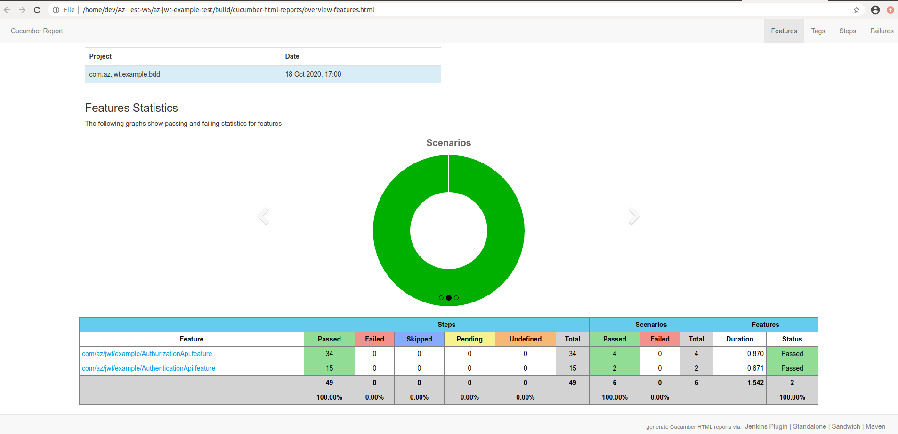
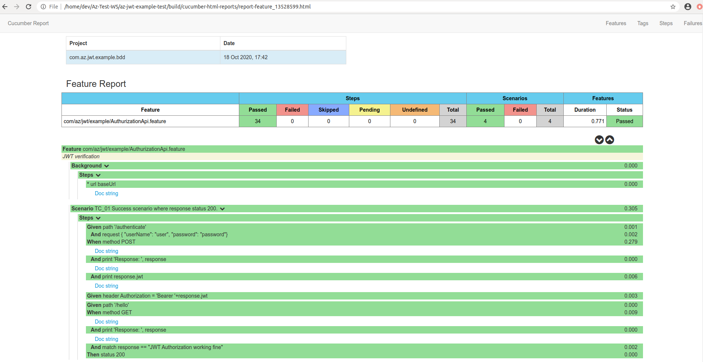
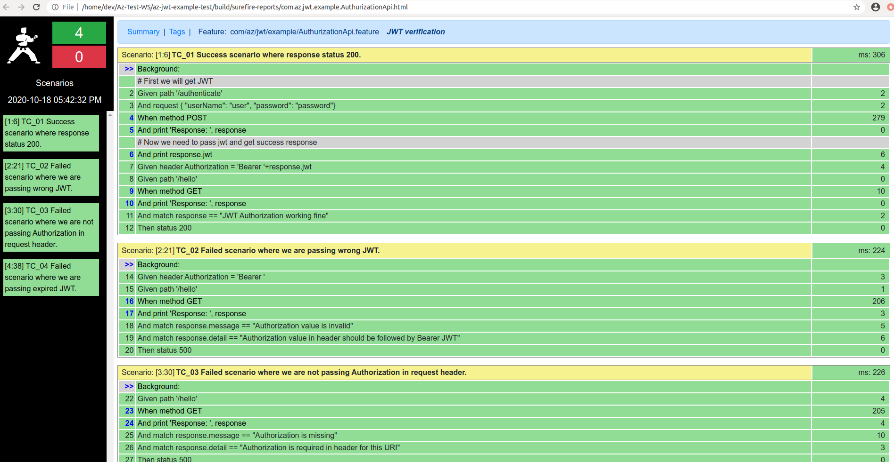

# Az-JWT-Example
### Framework and helping dependencises:
* In this microservice I'm doing `BDD` for other microservice `az-jwt-example`. With the help of bellow Dependencies:
    - `Java 11`
    - `Spring Boot`        
    - `JUnit 5 from spring boot starter`
    - `Karate for BDD`
    - `Cucumber reporting`
    - `gradle-docker plugin`
* I have created two feature files for `/authentication` and 2nd one for `/hello` end point with positive and negative scenarios.
* After `./gradlew clean build` please have a look on reports.

### How to run
* It's gradle project just simply run bellow command
```
./gradlew clean build bootRun
```
* If you want to run as docker image
```
./gradlew clean build docker
```
* Above command will create docker image and you can run docker image by
```
docker run --name az-jwt-example-test-container -p 7272:7272 -d az-jwt-example-test:latest
```
### Reports:
* Please have a look in bellow paths for reports
```
build/cucumber-html-reports/overview-features.html

build/surefire-reports/com.az.jwt.example.AuthurizationApi.html
```

### BDD All Cucomber reports




